## Getting started with AWS Solutions Architect Associate - SAA-C03

#### Author : Prabhu Arjunan

## **EC2 Instance, Snapshot, Volume, and AMI Creation</h3>**

# **Task 1: Launch an EC2 Instance** 

**Step 1:**

Log in to the Amazon Web Services Management Console and navigate to the Amazon EC2 Dashboard.

Select your preferred Region, then click Launch Instance.

**Step 2: Configure Instance Details**

In Launch Instance page fill in the details as shown below

***1\. Name and Tags***

    Used for identification and filtering.

Examples:

Name ,Environment (Dev/Test/Prod),Owner

Tags helps in:

     Cost allocation,Automation,Resource tracking

***2\. Number of Instances*** 

     (count \- Number of EC2 Instance to be created)

**3\. Choose Image (AMI)**

When launching an instance in Amazon EC2, you must select an AMI (Amazon Machine Image).

An AMI is a  blueprint or template used to launch EC2 instances.  
Each OS version has its own unique AMI ID (e.g., different AMIs for Amazon Linux 2023, Ubuntu 22.04, Windows Server 2022, etc.).

We Can Create  Own AMI

Launch an EC2 instance ,Install applications and necessary dependencies and  
Configure and we can Create an image from that instance

This creates a custom AMI.

After that, we can launch multiple identical instances from that custom AMI.

   

***4\. Instance type \-*** 

Defines CPU, Memory, and Network performance.

Example: t3.micro ( Choose based on your workload)

There are multiple instance families based on workload type:

General Purpose – Balanced CPU & memory (e.g., t3, m5)

Compute Optimized – High CPU workloads

Memory Optimized – High memory workloads

Storage Optimized – High disk throughput

GPU Instances – ML/AI workloads

Choose based on application requirements.

***5.Firewall Security Group:***  
    
Security Group controls inbound and outbound traffic***.***

If you want to access the machine or communicate with it on different ports you should always add security rules to allow. By default inbound is denied

SG (Instance level) is stateful If inbound traffic is allowed on a port, return traffic is automatically allowed.You don’t need separate outbound rule for response traffic.

Not like Nacl (Subnet-Level)  which is stateless even if inbound is allowed on a port, you must explicitly allow outbound return traffic (ephemeral ports).

***6.Storage Volumes:*** 

EC2 uses Amazon Elastic Block Store (EBS).

Common volume types:  
gp3 → General purpose (Recommended default)

gp2 → Older generation general purpose

io1/io2 → High IOPS workloads (databases)

For general workloads → gp3 is recommended.

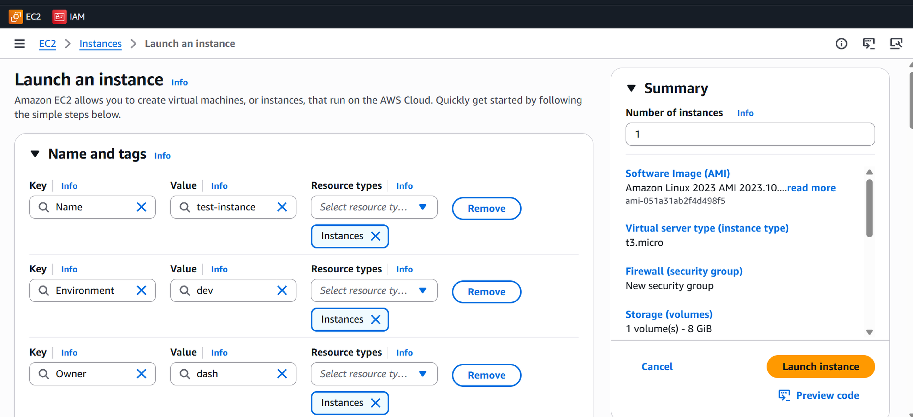

**Step 3: Create a Key value pair**

Give it a name

Choose Key type:  
RSA or ED25519

Choose Private key file format:

  **.pem** → For OpenSSH (Linux/Mac)

   **.ppk** → For PuTTY (Windows)

Once you click create Key pair a pem file will get downloaded to your local. Keep it safe. We cannot download it again.

The key pair is used for secure SSH authentication.

Instead of password login, AWS uses:

* Public key → Stored in EC2

* Private key (.pem) → Stored in local

We can connect to EC2 using

ssh \-i your-key.pem ec2-user@\<public-ip\>

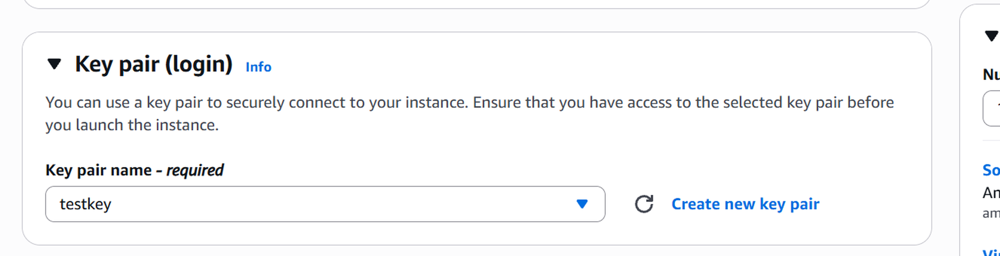

**Step 4: Network Settings**

  In Network settings as of now you can use default VPC and its subnet(across AZ) . By default in every region there will be a default VPC and its associated subnets. We can use it or we can create our own VPC and use of our choice

To connect to your machine via Internet Enable Public IP option . so we can ssh the Instance from anywhere if you have the Key. (If the IP is in allowed list)

As we discussed security group earlier by default all inbound traffic are denied so as of now we can enable port 22 for SSH and 80 and 443 for HTTP and HTTPS. I f you not add port 22 to security rule no matter what you are not able to SSH into the Instance 

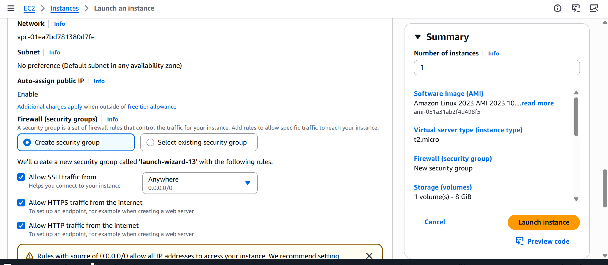

**Step 5: Storage**

As we discussed earlier we can choose storage volumes based on requirement standard gp3 gp2 and iops. For this instance we choose 8 GB gp3(general Purpose)

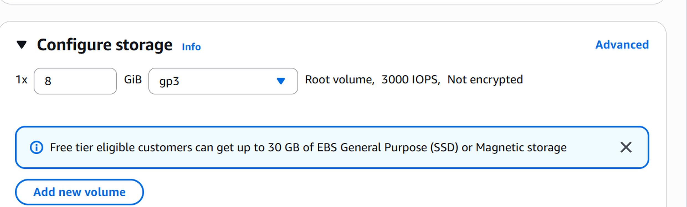

There are more advanced section in Instance where we can upload script, IAM (like adding role to this instance etc), Placement group etc . we can use if we need

Now if done click Launch instance. Now we see the instance is running.

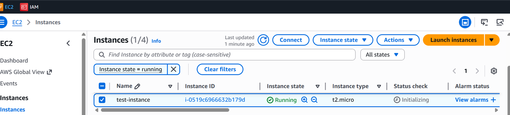

Once running we can verify by SSH into the VM. 

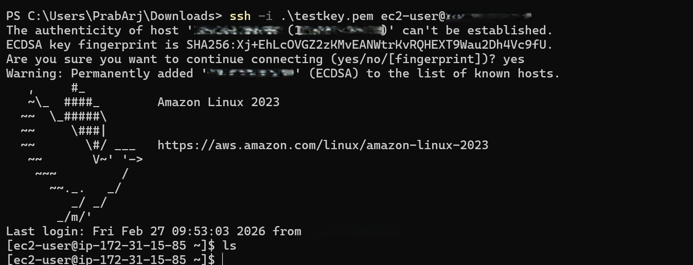

# **Task 2: Create a Snapshot of the Instance’s Root Volume**

**Step 1:**

Go to EC2 Main page →In left pane under EBS→ Click volume . You could see the volume there for the Instance we created in Task1

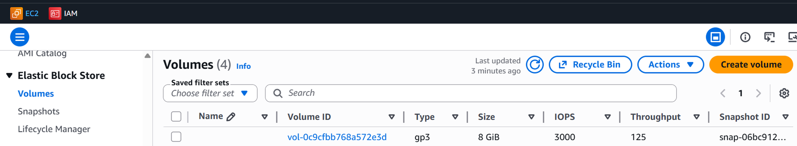

Now Slect the volume and Actions and click Create Snapshot

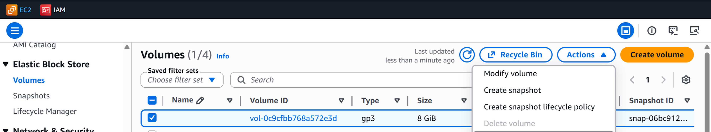

**Step2:**

Give a valid name and add Tags (if required) and Click create snapshot

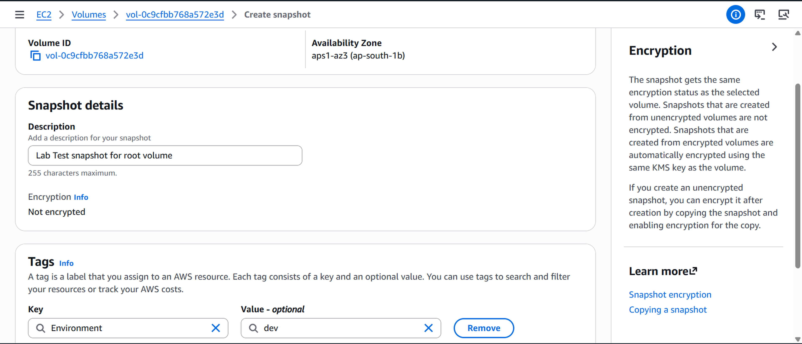

Now under EBS and go to snapshot and see if the status gets completed. Now this will create a snapshot for the volume

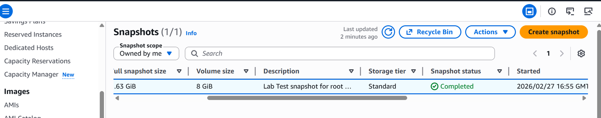

Once the snapshot is completed we can do multiple actions with the snapshot created like

Create volume from snapshot   
Create image from snapshot   
Copy etc.. which we will see in next tasks

# **TASK3: Create a New Volume from the Snapshot**

**Step1:**   
To create a new volume from the snapshot. Go to snapshots and find the one you created in Task 2

In EC2 Page→ In left pane under EBS→Snapshots→ Create New volume from snapshot

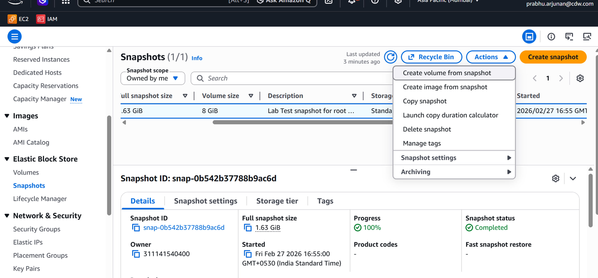

**Step2:**

  In Create volume page select the volume type,size,iops,Throughput and other details as necessary 

Note: The new volume you create should be in the same AZ as Your EC2 Instance. So before you click Create volume ensure both are in same AZ

Optionally if you want to encrypt the volume you can click the “Encrypt this volume”

Then click Create volume

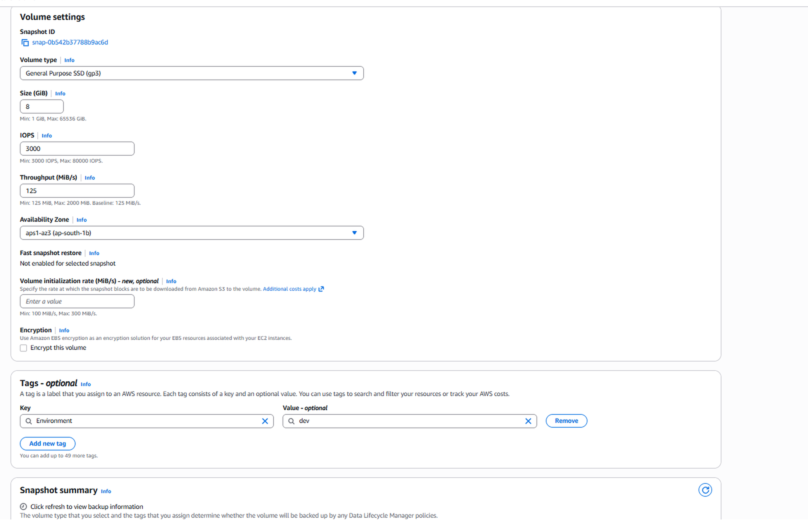

**Step3:  Attach the New Volume to EC2 Instance**

So once the volume gets created go to volume in left pane and find the Volume that got created from the snapshot.

You can identify by after creation it will display a Volume ID and also you can look out for Attached resources. Since this the new one created from snapshot you wont find any resource attached under it. We are going to attach the resource in next steps

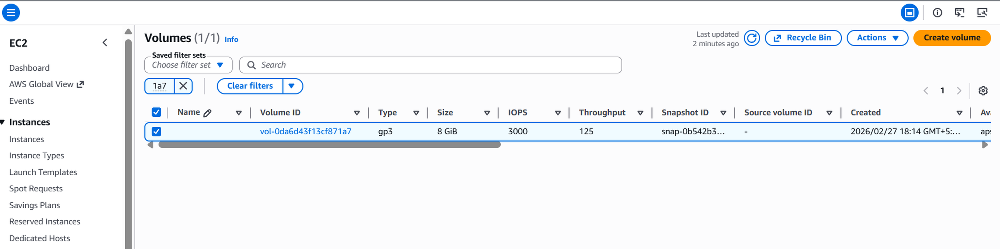

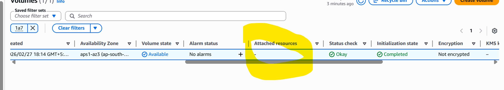

Now click the Volume →Actions→Attachvolume

In Attach volume page select the Instance you created earlier and also choose any of recommended device name from the list

Click Attach volume

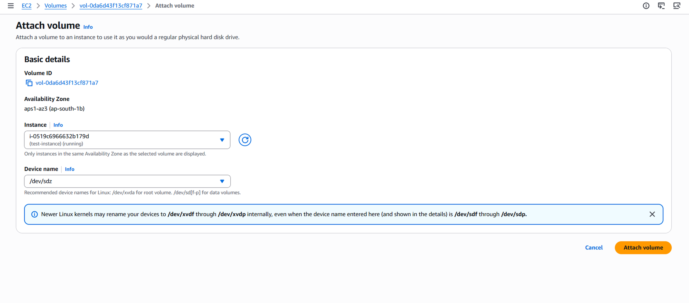

Now once the volume is attached to a resource . You can see the resource under attached resource.

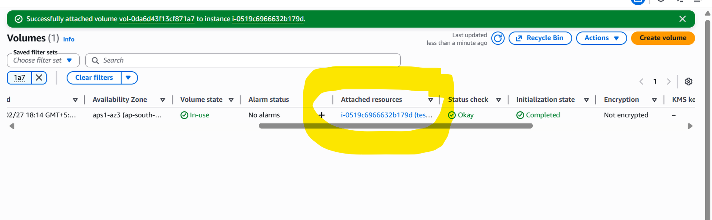
**Step4:**

  Now in EC2 Instance if we go to the Created Instance and in the storage tab you can see a new volume gets attached to it. The another volume is attached during creation.

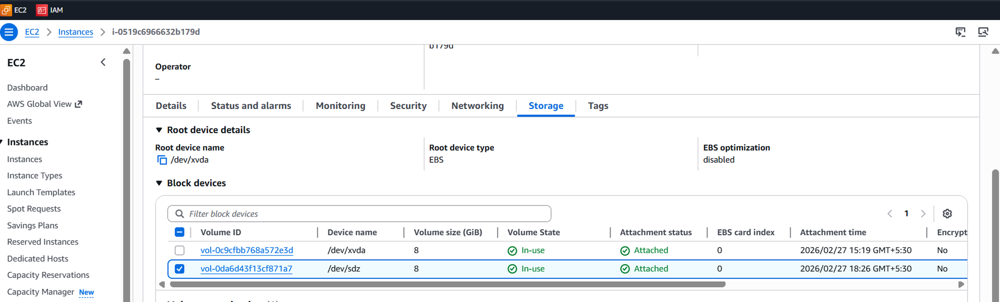

**Step 5:**

  **Now we have added the volume to EC2 Instance but still we did not mount it, We need to mount the volume so the EC2 instance can use it. In below screenshot you can see “XVDA” is mounted but “XVDZ” not. So we are going to mount it**

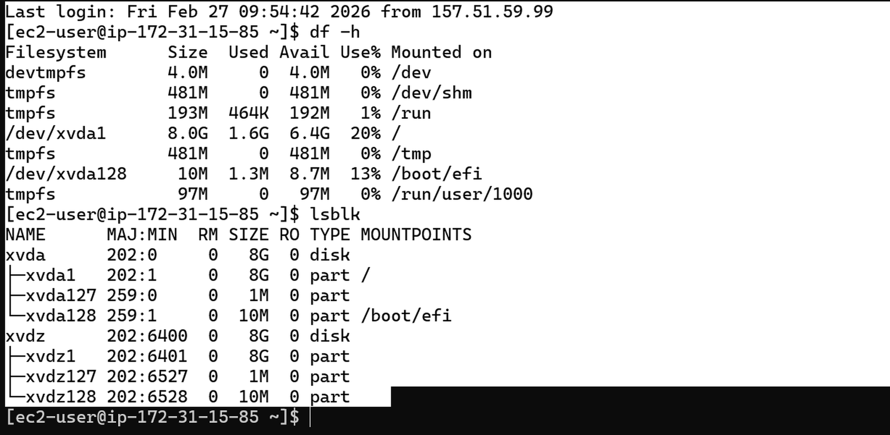

Follow the steps provided in the shared Amazon EBS Volume – Available for Use document to mount the attached volume to the EC2 instance.

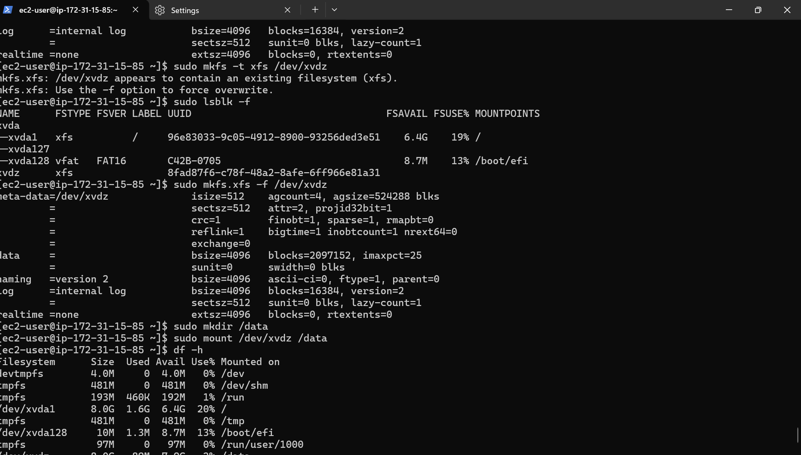

# **TASK 4: Create an AMI Using the Snapshot**

There are two common approaches:  
 • Option A: Create an AMI directly from your running instance.  
 • Option B: Register an AMI by using your snapshot as the root device.

 For this lab, we’ll use Option B:

**Step1:**

 For this we need to go to EC2→In left pane under EBS→Snapshots→Actions —\> Create image from snapshot

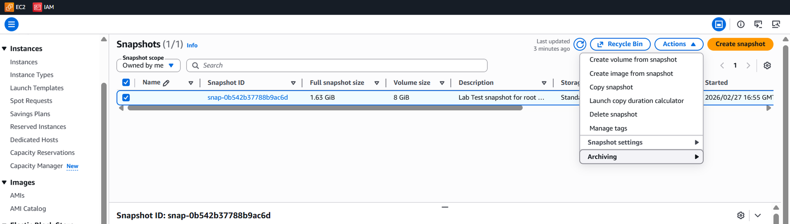

**Step2:**

  Enter all the details required for the AMI Creation and create image

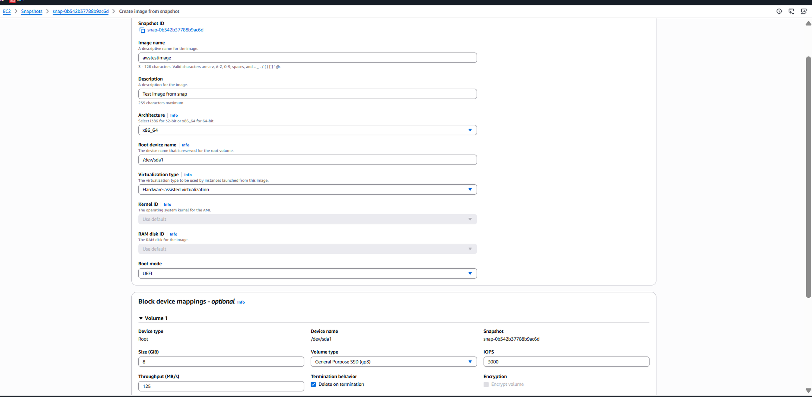

Once the image is created under Images → AMI. You will see the AMI that we created.

As we discussed in TASK 1 – Every os with different version will have different AMIs. Similarly the image we create from the Instance or from the snapshot will have different AMI assigned. We can use this AMI to build any number of Instances.

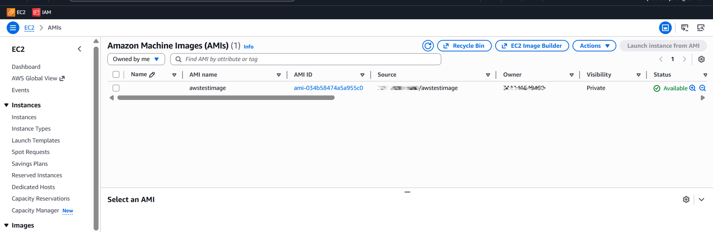

**Step3:**

Create a new Instance from this AMI

So in Launch instance page go to My AMIs →owned by me  
You will find the images we [created.we](http://created.we) can choose from it. If there is only one AMI it will be automatically picked  
Rest of the options are same as we did in TASK1

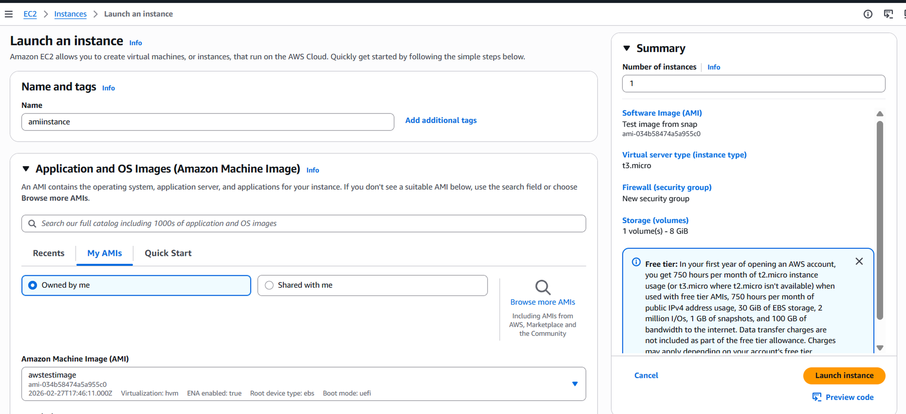

**Step4:**

A new instance has been created using the existing image and verify the connectivity

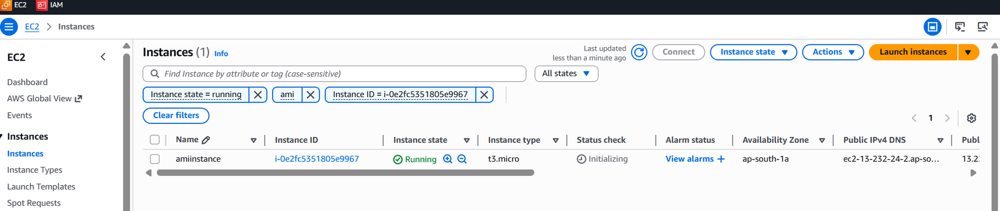

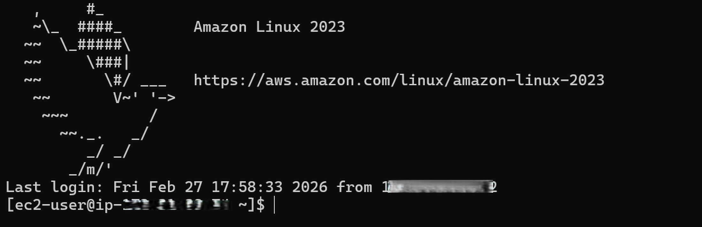